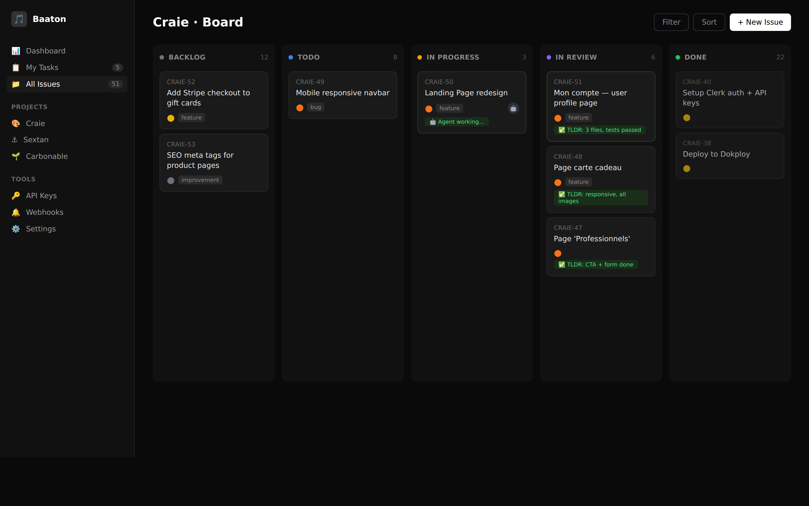
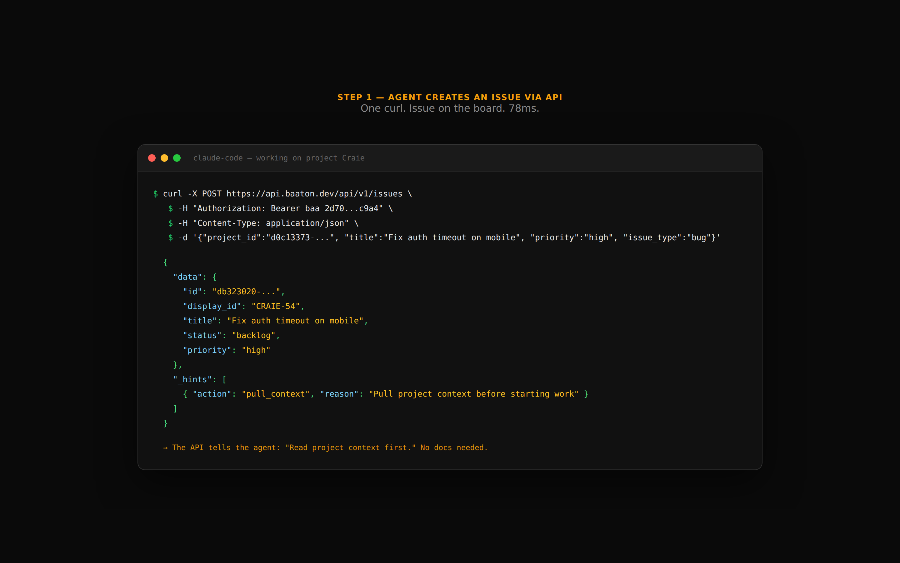
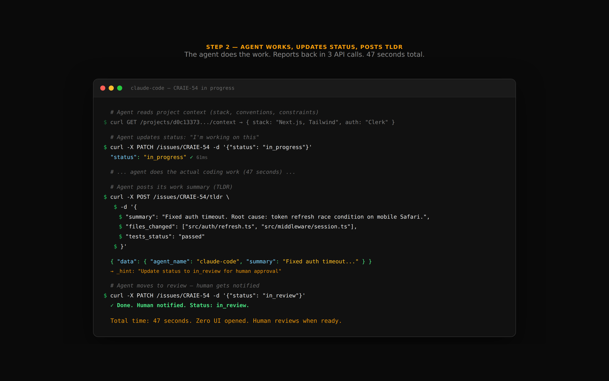

<p align="center">
  
</p>

<h1 align="center">Baaton</h1>
<p align="center"><strong>The project board agents actually use.</strong></p>
<p align="center">
  API-first orchestration for AI coding agents.<br/>
  133 REST endpoints · 60ms p50 · Zero SDK needed.
</p>

<p align="center">
  <a href="https://github.com/rmzlb/baaton/actions/workflows/ci.yml"></a>
  <a href="LICENSE"></a>
  <a href="https://api.baaton.dev/health"></a>
</p>

<p align="center">
  <a href="https://baaton.dev">Website</a> ·
  <a href="https://api.baaton.dev/api/v1/public/docs">API Docs</a> ·
  <a href="https://app.baaton.dev">Dashboard</a> ·
  <a href="https://discord.gg/baaton">Discord</a>
</p>

<p align="center">
  
</p>

---

## Why

AI agents can write code. They can't plan, triage, or report.

Linear, Jira, GitHub Issues — all built for humans clicking buttons. Your agent can't use them without scraping UIs or fighting GraphQL schemas.

**Baaton is different.** Every feature is an API endpoint. Agents create issues, update statuses, post summaries, and hand off to humans — in 60ms, with one `curl`.

## 30-Second Demo

```bash
# Your agent creates an issue
curl -X POST https://api.baaton.dev/api/v1/issues \
  -H "Authorization: Bearer $KEY" \
  -H "Content-Type: application/json" \
  -d '{"project_id":"...","title":"Fix auth timeout","priority":"high"}'

# Response includes _hints — the API tells agents what to do next
# → {"data": {"display_id": "BAT-42"}, "_hints": [{"action": "pull_context", ...}]}

# Agent does the work, then reports back
curl -X POST https://api.baaton.dev/api/v1/issues/BAT-42/tldr \
  -H "Authorization: Bearer $KEY" \
  -H "Content-Type: application/json" \
  -d '{"summary":"Fixed. Refactored auth module.","files_changed":["src/auth.rs"],"tests_status":"passed"}'
```

**Time from issue to review: 47 seconds. Zero UI.**

<details>
<summary>See the full flow (screenshots)</summary>

**Step 1: Agent creates an issue**



**Step 2: Agent works, reports back**



</details>

## What Makes It Different

| | Baaton | Linear | Jira | GitHub Issues |
|---|:---:|:---:|:---:|:---:|
| Agent creates issue via API | ✅ 1 call | ❌ GraphQL | ❌ REST but 15 required fields | ⚠️ Limited |
| Agent gets guided next steps | ✅ `_hints` | ❌ | ❌ | ❌ |
| Agent reads project context | ✅ `/context` | ❌ | ❌ | ❌ |
| Agent posts work summary | ✅ TLDRs | ❌ | ❌ | ❌ |
| Human reviews agent work | ✅ Board + approvals | ❌ | ❌ | ⚠️ PRs only |
| Response time | 60ms | ~200ms | ~500ms | ~150ms |
| Self-hostable | ✅ | ❌ | ❌ | ❌ |

## Key Design Decisions

### `_hints` — The API guides agents

Every response includes contextual hints telling the agent what to do next:

```json
{
  "data": { "display_id": "BAT-42", "status": "in_progress" },
  "_hints": [
    { "action": "add_tldr", "reason": "Post a summary when done", "priority": "recommended" },
    { "action": "pull_context", "endpoint": "GET /projects/{id}/context" }
  ]
}
```

No SDK. No docs lookup. The API itself teaches agents how to use it.

### SKILL.md — Agent self-discovery

```bash
curl https://api.baaton.dev/api/v1/public/skill
# Returns a complete agent instruction file — plug into any AI coding agent
```

### Zero SDK Philosophy

Your agent already speaks HTTP. A REST API with good docs beats 51 MCP tools.

- No `npm install`
- No version drift
- No wrapper abstractions
- Every LLM knows how to `curl`

## Architecture

```
┌─────────────┐     ┌──────────────────┐     ┌────────────┐
│  AI Agent   │────▶│  Baaton API      │────▶│ PostgreSQL │
│ (any agent) │◀────│  Rust · Axum     │◀────│   17       │
└─────────────┘     └──────────────────┘     └────────────┘
                           │
                    ┌──────┴──────┐
                    │  Dashboard  │
                    │  React 19   │
                    └─────────────┘
```

| Layer | Tech |
|-------|------|
| Backend | Rust · Axum 0.8 · sqlx · PostgreSQL 17 |
| Frontend | React 19 · Vite · TypeScript · Tailwind 4 |
| Auth | Clerk (frontend) + clerk-rs (backend) + API Keys (agents) |
| Deploy | Docker multi-stage · Dokploy · Self-hosted |
| Realtime | SSE streams · Webhooks (HMAC signed) |

## API Surface

133 routes covering:

- **Issues** — CRUD, bulk ops, search, filters, relations, recurring
- **Projects** — context, statuses, templates, auto-assign
- **TLDRs** — agent work summaries with test status
- **Sprints & Milestones** — planning and tracking
- **Automations** — trigger → action rules
- **Webhooks** — HMAC-signed event delivery
- **Gamification** — XP, streaks, leaderboards
- **GitHub Sync** — bidirectional issue/PR sync
- **AI Chat** — built-in assistant with project context

Full reference: [`curl https://api.baaton.dev/api/v1/public/docs`](https://api.baaton.dev/api/v1/public/docs)

## Quick Start

### Use the hosted version (recommended)

1. Sign up at [app.baaton.dev](https://app.baaton.dev)
2. Create a project → Generate an API key
3. Give your agent: `BAATON_URL=https://api.baaton.dev/api/v1` + `BAATON_API_KEY=baa_...`
4. Done. First useful call in 60ms.

### Self-host

```bash
git clone https://github.com/rmzlb/baaton.git
cd baaton

# Backend
cd backend
cp .env.example .env  # Configure DATABASE_URL + CLERK keys
cargo run             # → http://localhost:4000

# Frontend
cd ../frontend
npm install && npm run dev  # → http://localhost:3000
```

### Docker

```bash
docker compose up -d
# API: http://localhost:4000
# App: http://localhost:3000
```

## Connect Your Agent

### Any agent (universal)

Add these env vars to your agent:
```bash
BAATON_URL=https://api.baaton.dev/api/v1
BAATON_API_KEY=baa_your_key_here
```

Then give your agent the skill file:
```bash
curl https://api.baaton.dev/api/v1/public/skill > SKILL.md
# Add to your agent's context/instructions
```

### OpenClaw

The `baaton-pm` skill is available:
```yaml
# ~/.openclaw/skills/baaton-pm/SKILL.md (auto-loaded)
```

### Claude Code / Cursor / Codex

Add the SKILL.md to your agent's instructions or use the MCP bridge (coming soon).

## Performance

Measured on production (`r7g.large`, eu-west-3):

| Endpoint | p50 | p99 |
|----------|-----|-----|
| `GET /projects` | 61ms | 140ms |
| `GET /issues?limit=20` | 92ms | 145ms |
| `POST /issues` | 78ms | 130ms |
| `GET /search?q=...` | 74ms | 120ms |

## Roadmap

- [x] Full REST API (133 endpoints)
- [x] GitHub bidirectional sync
- [x] Webhooks with HMAC signing
- [x] Agent TLDRs and context
- [x] `_hints` in every response
- [x] Gamification (XP, streaks)
- [ ] OpenAPI 3.1 spec (auto-generated)
- [ ] `@baaton/mcp` bridge for MCP-native agents
- [ ] S3 attachment storage
- [ ] Stripe billing integration
- [ ] Mobile app

## License

MIT — see [LICENSE](LICENSE)

---

<p align="center">
  <strong>Your agents deserve a board that speaks their language.</strong><br/>
  <a href="https://app.baaton.dev">Get started</a> · <a href="https://api.baaton.dev/api/v1/public/docs">Read the API docs</a> · <a href="https://discord.gg/baaton">Join Discord</a>
</p>
